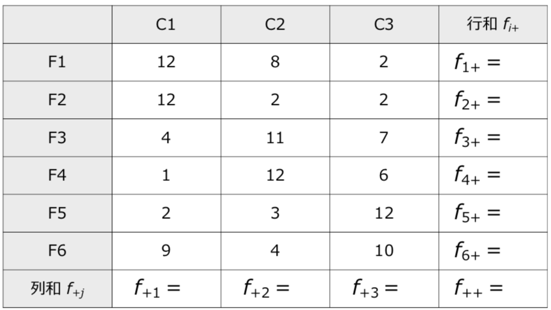
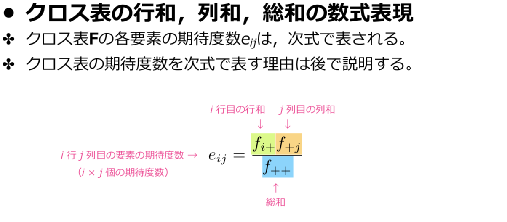
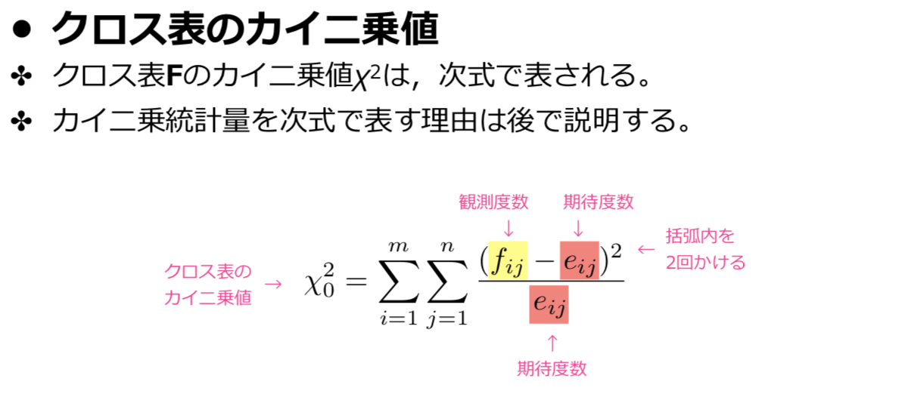
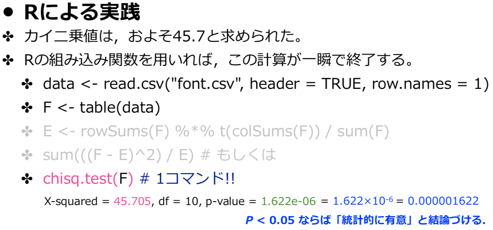

# カイ二乗値


### カイ二乗値









### 結論

P値が0.05未満であったことから，==クロス表の行と列は独立でない(統計的に有意な関連がある)==と主張することができる

- P値を有意確率，カイ二乗値を検定統計量という。

```R
data <- read.csv("font.csv", header=TRUE, row.names=1)
F <- table(data)
chisq.test(F)
```

