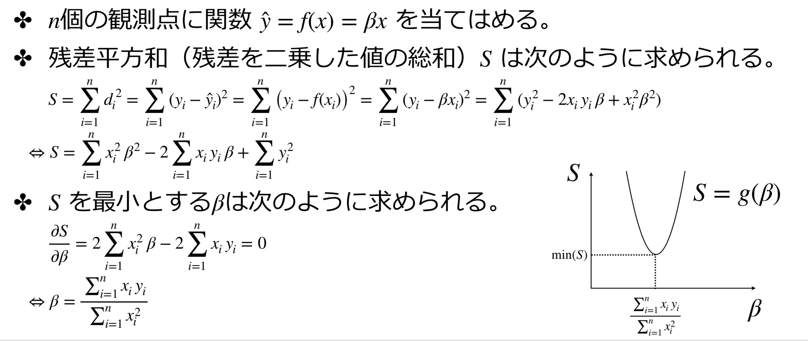
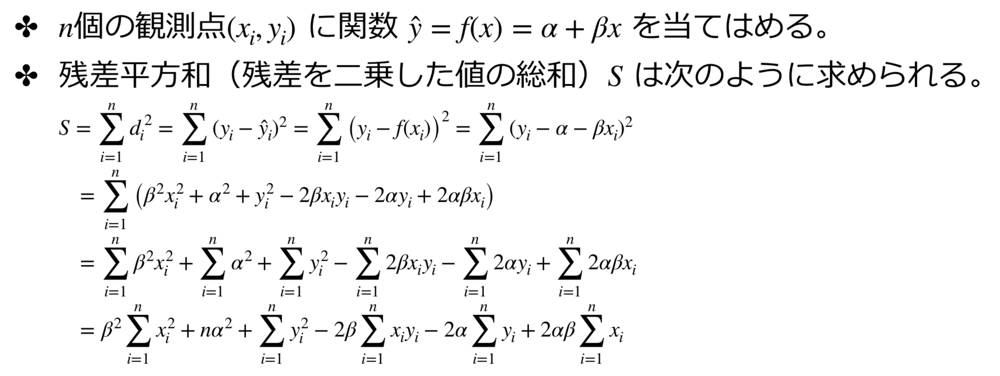
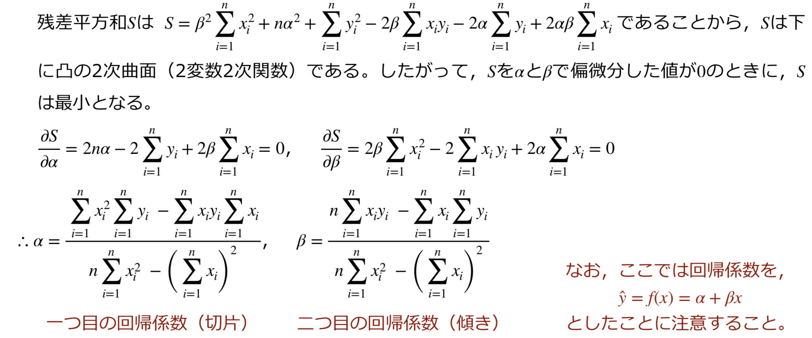

# 回帰分析

## 最小二乗法


### 切片なしのモデル



```R
x<-c(1,2, 4, 5)
y <- c(3, 2, 12, 35)

# A <- 0
# B <- sum(x*y) / sum(x^2)
result <- lm(y ~ x)			# 回帰分析
A <- result$coefficients[1]
B <- result$coefficients[2]
predictedY <- A + B * x

plot(x, y, xlim = c(0, 6), ylim = c(-5, 40))
abline(a = A, b = B, col = "red")
predictedY <- A + B * x
points(x, predictedY, col = "red")
segments(x, y, x, predictedY)

d <- y - predictedY		# 実は計算しなくてもresult$residualsに入っている。
cat("S =", sum(d^2))	# 残差平方和
```

### 切片ありのモデル(単回帰モデル)





```R
x<-c(1,2, 4, 5)
y <- c(3, 2, 12, 35)

result <- lm(y ~ x)			# lm()が内部で下記のような計算を実施したということ
A<-result$coefficients[1]	#(46* 52-230*12)/(4*46-12^2)
B<-result$coefficients[2]	#(4*230- 12*52)/(4*46-12^2)
predictedY <- A + B * x

plot(x, y, xlim = c(0, 6), ylim = c(-5, 40))
abline(a = A, b = B, col = "red")
predictedY <- A + B * x
points(x, predictedY, col = "red")
segments(x, y, x, predictedY)

d <- y - predictedY
cat("S =", sum(d ^ 2))
```

### 重回帰モデル

- 回帰式を1変数とする場合は，==単回帰モデル==という。

- 回帰式を*m*変数とする場合は，==重回帰モデル==という。

    観測した多変量データに関数 $\hat{y} = f(x) = \alpha + \sum_{i=1}^{n} \begin{eqnarray*} \beta_i x_i \end{eqnarray*}$  を当てはめる手法を==線形重回帰分析==という

    ```R
    result <- lm(grmax ~ ht + age, data = df)
    ```

    また、==質的変数==を回帰式に取り入れたモデルもある

    ```R
    result <- lm(grmax ~ sex + ht + age, data = df)		# 重回帰分析
    plot(df[, c(2, 5)], type = "n")						# 枠だけ描画
    points(df[df$sex == "M", c(2, 5)], col = "blue")	# 後から描画
    points(df[df$sex == "F", c(2, 5)], col = "red")		# 後から描画
    summary(result)										# 結果の詳細
    ```

    