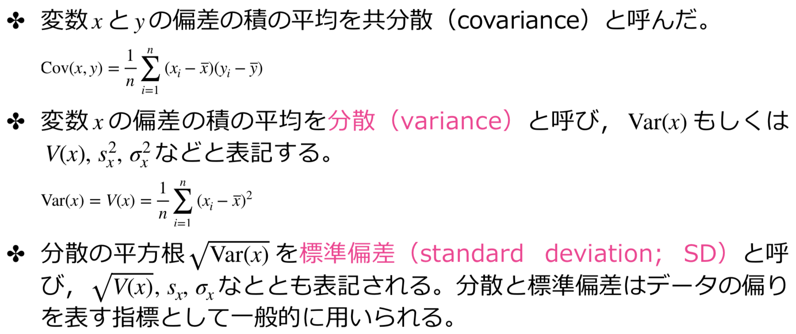
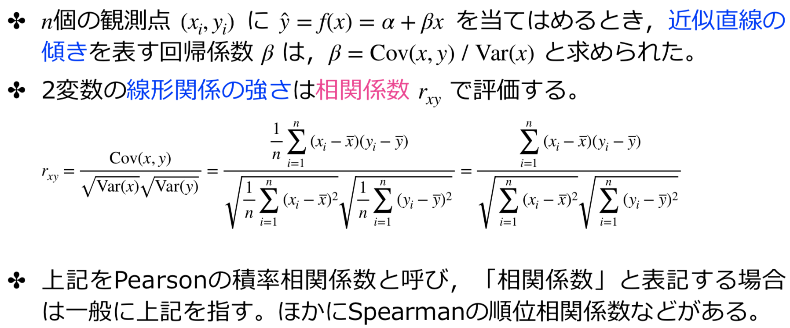
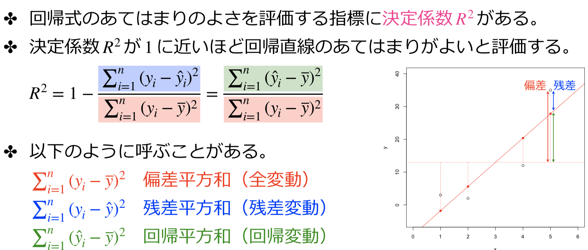

# 相関分析

### 残差、偏差

* 回帰分析では，観測値$\begin{eqnarray*} y_i \end{eqnarray*}$と予測値$\bar{y}$の差$\begin{eqnarray*} y_i - \hat{y_i} \end{eqnarray*}$を残差という
* 観測値$\begin{eqnarray*} && x_i \end{eqnarray*}$と平均値$\bar{x}$の差$\begin{eqnarray*} x_i - \bar{x} \end{eqnarray*}$を偏差という
* 偏差の和は0になる。故に，偏差の平均も0になる。

### 共分散、分散、標準偏差



### 相関係数



```R
df <- read.csv("physical.csv")
plot(df[, 2:6])
cor(df[, 2:6])
```

### 決定係数




```R
x<-c(1,2, 4, 5)
y <- c(3, 2, 12, 35)
cor(x, y)
cor(x, y) ^ 2
result <- lm(y ~ x)
summary(result)
```

