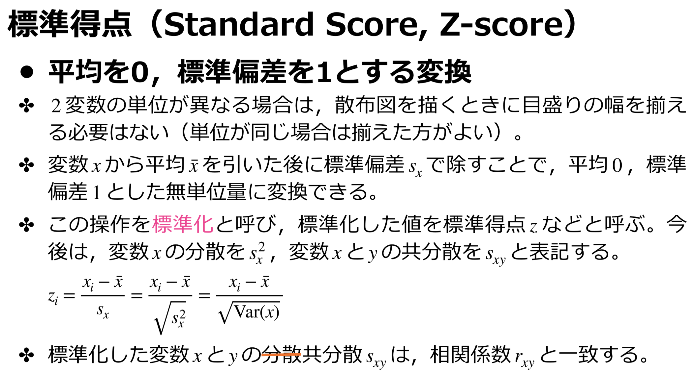
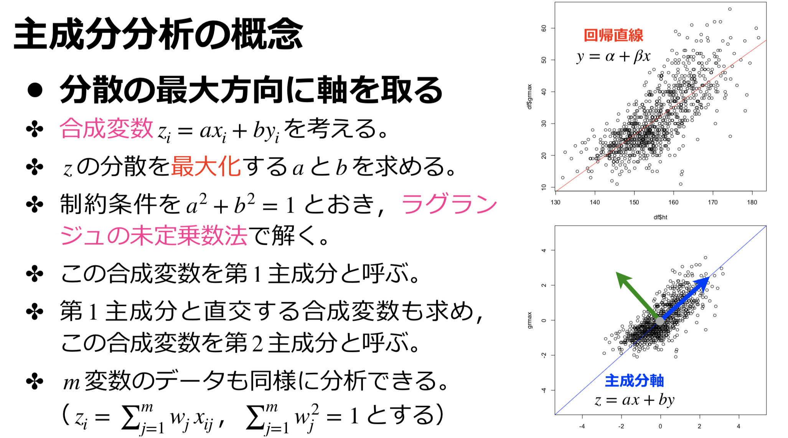
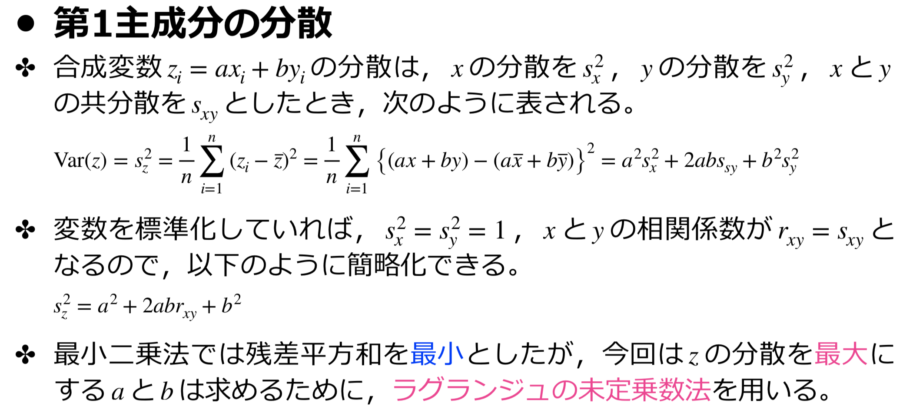
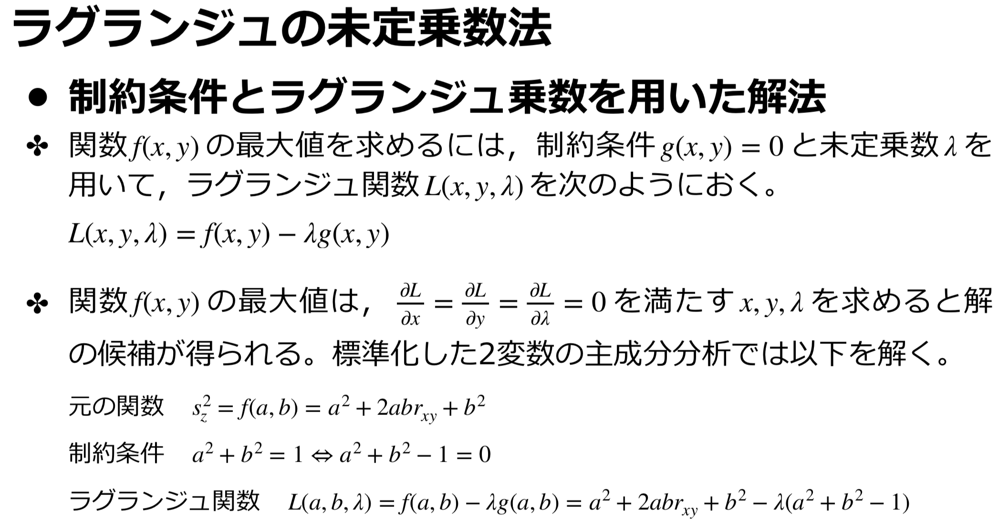
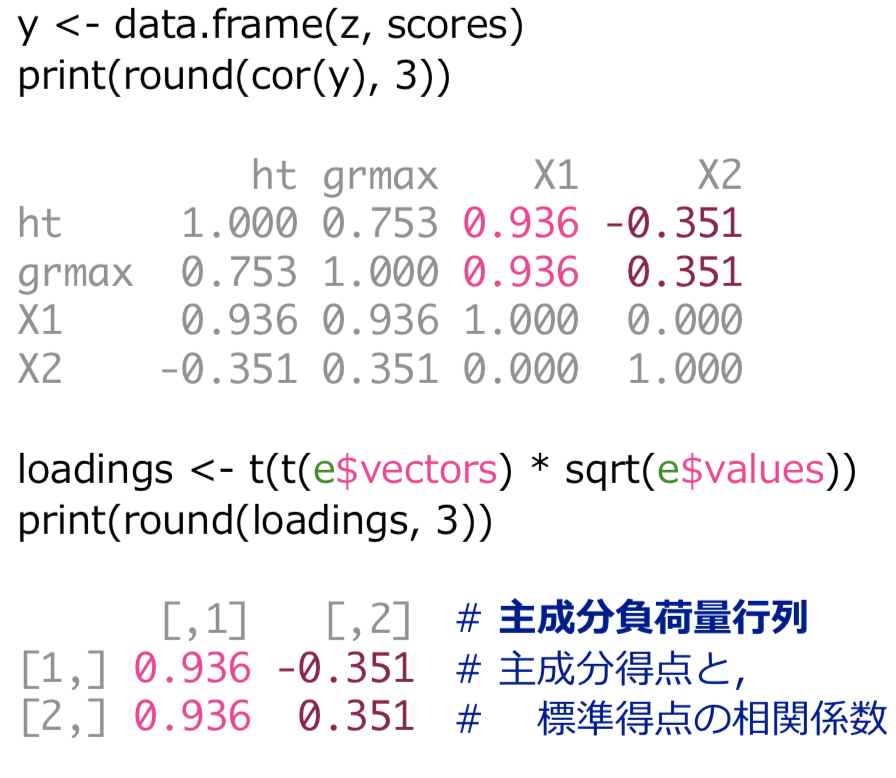
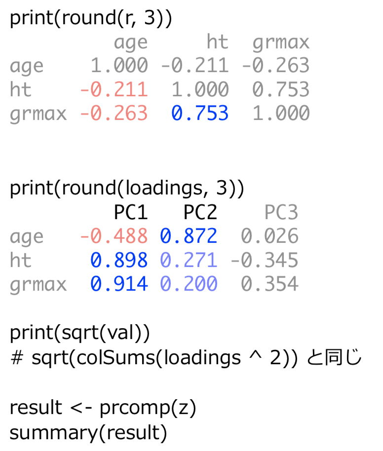

# 主成分分析

## 標準化



## 主成分分析

### 概念

### 



### やり方





### Rでのやり方①

```R
x <- read.csv("physical.csv")
z <- x[, c(3, 5)]
z <- scale(z)		# 標準化(平均0，分散1)
r <- cor(z)			# 相関係数
print(r)

e <- eigen(r)		# 固有値、固有ベクトルの計算
print(e$values)
print(e$vectors)
scores <- z %*% e$vectors	# 標準得点と固有ベクトルの積

layout(matrix(1:2, 1, 2))
plot(z, xlim = c(-5, 5), ylim = c(-5, 5))
beta <- e$vectors[2, 1] / e$vectors[1, 1]
abline(a = 0, b = beta, col = "red")

plot(scores, xlim = c(-5, 5), ylim = c(-5, 5))
abline(h = 0, col = "red")
print(round(var(scores), 6))
print(round(cor(scores), 6))
```



### Rでのやり方②

```R
x <- read.csv("physical.csv")

z <- scale(x[, c(2, 3, 5)])
r <- cor(z)
e <- eigen(r)
vec <- e$vectors
val <- e$values

vec[, 1] <- - vec[, 1]
loadings <- t(t(vec) * sqrt(val))
rownames(loadings) <- colnames(z)
colnames(loadings) <- paste("PC", 1:ncol(z), sep = "")

scores <- z %*% vec
colnames(scores) <- paste("PC", 1:ncol(z), sep = "")
plot(scores[, c(1, 2)], xlim = c(-5, 5), ylim = c(-5, 5))
```

